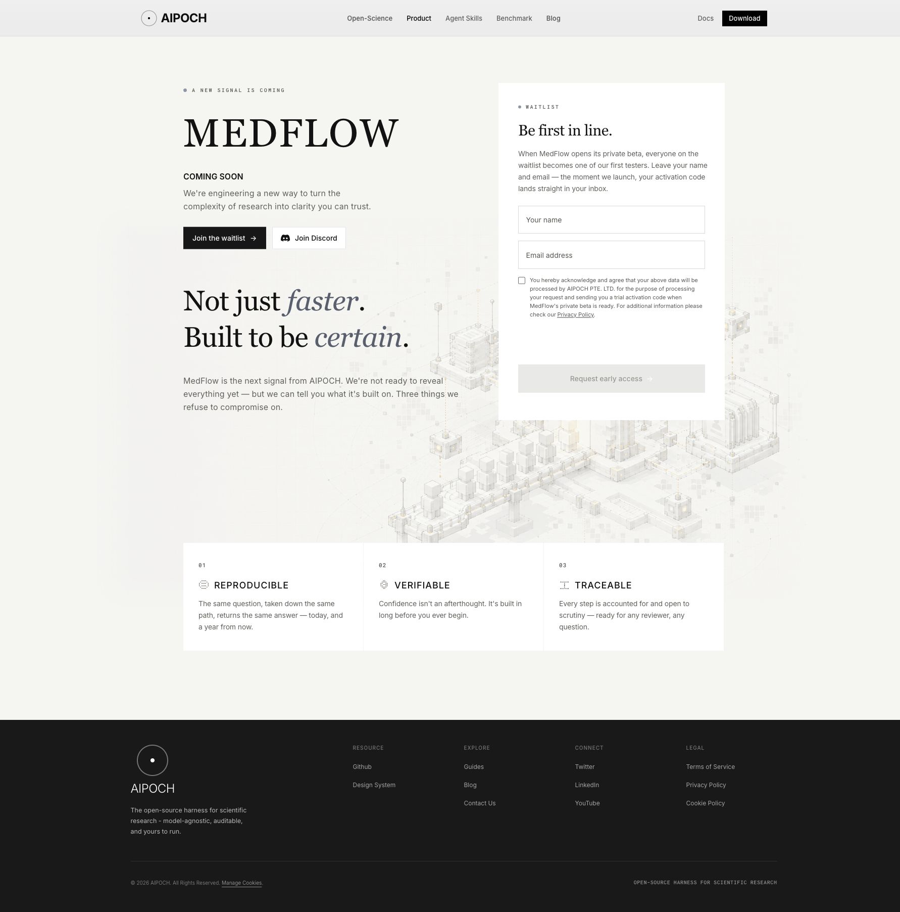

# MedFlow Figma HTML preview

Open `index.html` directly in a browser. All fonts, the original background, artwork,
styles, and browser JavaScript are embedded. The HTML does not require a build or a
server to view. Internal site links resolve to `https://aipoch.com`.

## Source and fidelity

- Design: https://www.figma.com/design/6zS3GvT25svG6reU1oFKVi/AIPOCH-Website-Hi-Fi?node-id=1268-77
- Figma exports are preserved under `source/` for inspection.
- The MedFlow main area uses the original SVG text layers, paths, image, coordinates,
  colors, spacing, and line breaks. Native HTML inputs own their field text,
  caret, selection, clipping, and focus state; their dimensions, fonts, colors,
  and border tokens match the exported fields.
- The content preserves the 1440 px desktop artboard. Smaller screens can scroll
  the content horizontally; no unprovided mobile layout has been invented.
- Inter and Roboto Mono are embedded. Georgia uses the installed system font,
  matching the design on this Mac. A device without Georgia needs that font for
  the same serif rendering.
- The navigation and footer are imported directly from
  `components/navbar/index.tsx` and `components/footer.tsx`. The shared navigation has no shadows and uses square Download buttons.
  Active Product state, dropdowns, mobile menu, links, and Cookie preferences are
  retained. Shared CSS is compiled from the repository's existing stylesheet.
- Cookie preferences use the existing banner component. The standalone review
  artifact does not load the site's analytics controller or server environment.

## Form demonstration

No registration data is sent or stored. Valid submissions demonstrate the original
submitting and success frames; the success frame retains the original sample name
“Lyla”. Invalid email addresses show the original validation message.

Add one of these queries to the HTML URL to inspect an original state:

- `?state=default`
- `?state=typing`
- `?state=completed`
- `?state=error`
- `?state=submitting`
- `?state=success`
- `?state=server`
- `?state=duplicate`

Use `?result=server` or `?result=duplicate` to demonstrate those outcomes after
submitting the local form. No review toolbar or additional copy is inserted into
the design.

## Reproduce the artifact

Run from the repository root, using the existing installed dependencies:

```sh
python3 output/medflow-redesign/src/extract-scenes.py
bun output/medflow-redesign/src/build.mjs
```

These commands only write the standalone artifact. They do not modify application
build settings, environment files, package definitions, deployment, or production
routes. This PR also changes the shared navigation; its sitemap update scope is
documented in `NAVIGATION-UPDATE.md`.

## Verification

- Compiled the standalone HTML successfully.
- Browser checks: original 1440 px composition, disabled empty form, email validation,
  submitting lock, success frame, Product dropdown, 390 px mobile navigation, Cookie
  preferences dialog, and original server/duplicate messages.
- Browser console: no warnings or errors observed.
- Repository unit tests: 235 passed, 0 failed (run during this task).
- `bun run typecheck`: passed.
- Biome lint on the three authored preview source files: passed with no diagnostics.
- `bun run lint`: failed. The full-repository scan also lints the generated HTML's
  bundled third-party JavaScript/CSS and reports many generated-code diagnostics,
  alongside existing source warnings and a Biome schema/version notice. No shared
  configuration or validation rules were changed to hide these findings.
- Final diff review: changes include this standalone preview, shared navigation,
  page dates, and corresponding tests. Protected operational configuration is unchanged.

## Input interaction correction

The two fields previously shared the entire typing frame and mirrored invisible
input text into SVG. Each field now renders native editable text and its own
focus decoration. Static SVG field borders, labels, and sample carets are removed
from the interactive render. Original exports remain unchanged.

Browser regression checks passed for independent focus, Tab navigation, insertion
in the middle of a value, select-all, horizontal scrolling of long values, email
validation, consent gating, and the submitting lock. Authored JSX/CSS lint passed.
This correction only updates the standalone artifact; application pages, the
sitemap, shared components, and protected operational configuration are unchanged.

## Background seam correction

The raster's gray perimeter produced a visible rectangle against the page color
on wide screens. An SVG luminance mask now feathers the outer 80 px horizontally
and 64 px vertically into the original page background. The image file, layer
position, dimensions, central artwork, and 0.42 opacity remain unchanged. All eight
state exports use the same correction. Browser inspection confirmed that the
hard seam is gone, with no console errors. Original Canvas layers were compared
against all eight source exports and match apart from the added mask attribute.
Only the standalone output changes; no route, sitemap, or infrastructure update
is required.

## Success celebration

The success state now plays a single canvas-confetti celebration. Its three bursts,
particle counts, spread, velocities, and lifetimes reuse the existing site's
`app/(commonLayout)/medflow/medflow-effects.tsx` parameters. The green, orange,
yellow, blue, and black colors match solid particles sampled from the supplied
Figma screenshot. The Figma motion API required reauthentication, so no claim is
made that these physics parameters were exported from the Figma timeline.

The overlay is contained within the existing main artboard, ignores pointer events,
clears itself when the particles finish, and is reset when returning to the form.
It respects reduced-motion preferences. Loading `?state=success` also plays it once.
No dependency, application route, shared component, or operational configuration
was changed; no sitemap update is needed.

Browser verification covered the real submit-to-success transition, visible moving
particles, automatic completion, no replay on menu interaction, cleanup on return
to the form, and no celebration for default or validation-error states. The browser
console showed no warnings or errors. Authored JSX/CSS lint passed.

## Site-wide navigation update

The later request to remove navigation shadows applies to the real shared website
component as well as this artifact. This supersedes the earlier artifact-only
scope statements above. See `NAVIGATION-UPDATE.md` for the affected sitemap URLs,
persistent date source, verification results, and deployment scope.

## Review screenshot



The production `/medflow` route is not replaced by this standalone HTML preview.
